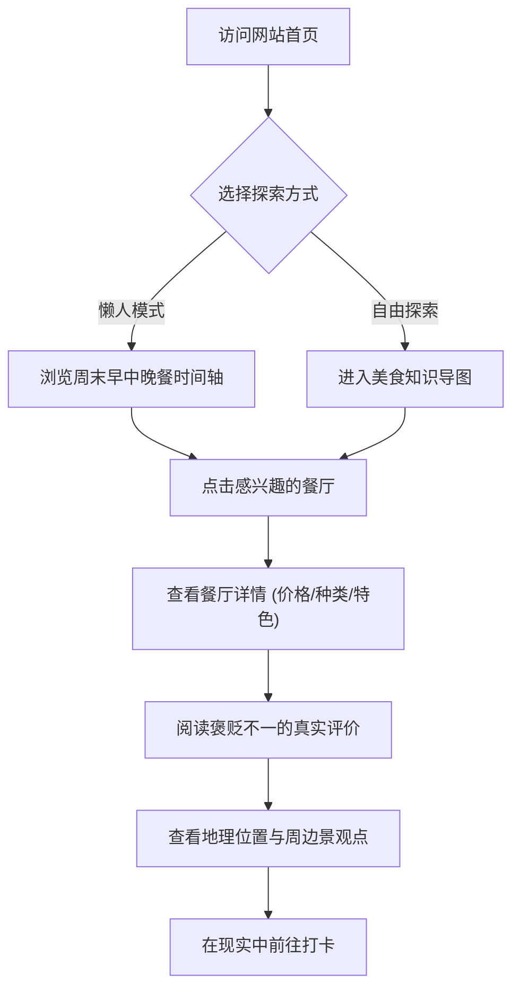

## 1. 产品概述
一款专为周末（周六周天）赴长沙游玩的旅客打造的高级感美食与景观推荐Web应用。
通过直观的知识导图、时间轴规划和真实的多维评价，帮助新手小白轻松规划早中晚餐及周边游玩路线。

- **主要目的、解决的问题、目标用户**：解决游客在长沙面对海量美食信息时的选择困难症；打破“全是好评”的虚假滤镜，提供褒贬不一的真实评价；结合地理位置将美食与景观绑定。目标用户为计划周末去长沙游玩、希望获取真实且有格调的吃喝玩乐指南的年轻旅客及新手小白。
- **产品目标或市场价值**：打造一个无“人机感”、充满杂志级审美、可在微信直接打开分享的高品质长沙本地游导览标杆应用。

## 2. 核心功能

### 2.1 用户角色
| 角色 | 注册方式 | 核心权限 |
|------|----------|----------|
| 游客 | 免注册 | 浏览所有推荐路线、知识导图、餐厅详情与真实评价 |

### 2.2 功能模块
1. **首页 (Home)**：氛围感全屏视觉、周末48小时美食时间轴（早中晚餐）、精选餐厅流。
2. **知识导图页 (Knowledge Map)**：交互式美食导图，展示餐厅类别、价格范围、美食种类（如湘菜、粉面、小吃）及对应地理位置。
3. **详情页 (Detail)**：餐厅图文详情、多方真实评价（优缺点并存）、特色必点菜、周边景观点及打卡路线。

### 2.3 页面详情
| 页面名称 | 模块名称 | 功能描述 |
|----------|----------|----------|
| 首页 | 48小时时间轴 | 以周六周日为时间线，串联起早、中、晚餐的推荐餐厅及过渡时段的景观打卡。 |
| 首页 | 氛围感首屏 | 高级感排版，吸引眼球的视觉冲击力，奠定非机器生成的独特调性。 |
| 导图页 | 交互式导图 | 允许用户通过点击不同节点（如“人均50内”、“夜市小吃”）探索对应的餐馆和地点。 |
| 详情页 | 真实评价卡片 | 结构化展示环境、口味、服务评分，明确列出“值得尝试”与“可能踩雷”的真实反馈。 |
| 详情页 | 地理景观联动 | 标注餐厅具体位置，并推荐步行或短途可达的景观点（如橘子洲、岳麓山、五一广场）。 |

## 3. 核心流程
用户进入首页后，可选择跟随“周末48小时”时间轴直接获取懒人行程，或进入“知识导图”自由探索美食分类。选中感兴趣的餐厅后，进入详情页查看真实评价、具体位置及周边景观，最终在现实中前往打卡。

## 4. 界面设计
### 4.1 设计风格
- **主次颜色**：主色调采用深邃的“湘红”（Crimson Red，代表辣椒与市井活力）与“暗夜黑”（高级感），辅以大面积的“米白/暖灰”（增加呼吸感和杂志排版感）。
- **按钮风格**：极简线条或纯色直角/微圆角，去除多余的阴影和3D效果，强调几何切割的高级感。
- **字体与大小**：标题使用优雅的粗体衬线字（或具有设计感的无衬线黑体），正文使用清晰易读的现代无衬线体，字号层级分明，拉开对比度。
- **布局风格**：Editorial（杂志排版）风格。打破常规网格，使用不对称布局、大留白、以及文字与图片的交错穿插。
- **图标/插图风格**：细线描边图标，或极简的几何图形，避免使用粗糙或过于常见的免费图标库，确保每一处细节都显得精心设计。

### 4.2 页面设计概览
| 页面名称 | 模块名称 | UI元素 |
|----------|----------|--------|
| 首页 | 首屏 Hero | 大字号排版、满屏质感背景图、平滑的滚动视差动画（Parallax）。 |
| 首页 | 时间轴 | 垂直或水平的优雅线条串联时间点，悬浮卡片展示餐厅微缩图。 |
| 导图页 | 知识导图节点 | 动态连线，平滑的节点展开动画，标签化展示价格与分类。 |
| 详情页 | 评价模块 | 采用红黑双色对比排版，“红”代表推荐，“黑/灰”代表避坑，视觉直观。 |

### 4.3 响应式
- **移动端优先 (Mobile First)**：由于用户要求“在微信上直接打开”，UI必须在手机屏幕上表现完美。
- **触摸优化**：放大可点击区域，支持手势滑动查看图片或切换导图节点。
- **桌面端适配**：在桌面端展开为多栏布局，利用更宽的屏幕展现知识导图的完整宏观视角。