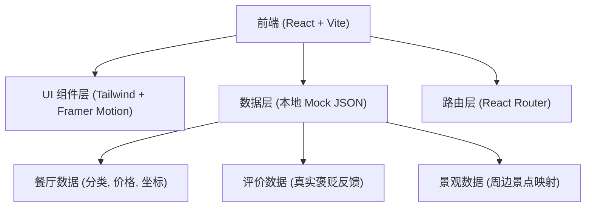

## 1. 架构设计


## 2. 技术栈说明
- **前端框架**: React@18
- **构建工具**: vite, vite-init
- **样式方案**: tailwindcss@3 (提供高效的原子化 CSS，便于实现杂志级排版)
- **动画与交互**: framer-motion (实现平滑的页面过渡、滚动视差、节点展开等高级感动画)
- **图标与图标**: lucide-react (极简现代图标库)
- **数据管理**: 本地 Static JSON 驱动 (为了确保在微信内秒开且无需额外部署后端服务)

## 3. 路由定义
| 路由 | 目的 |
|-------|---------|
| `/` | 首页：周末48小时美食时间轴与首屏视觉 |
| `/map` | 知识导图页：交互式分类探索 |
| `/restaurant/:id` | 详情页：餐厅详情、真实评价、周边景观与位置 |

## 4. 数据模型 (本地 JSON 结构定义)
### 4.1 核心数据接口 (TypeScript)
```typescript
// 餐厅与景观聚合接口
interface Place {
  id: string;
  name: string;
  type: 'restaurant' | 'spot'; // 餐厅或景观点
  category: string; // 湘菜, 粉面, 小吃, 观光等
  priceRange: string; // 人均价格，如 "¥50-100"
  location: {
    address: string;
    coordinates?: [number, number]; // 经纬度（可选，用于地图展示）
    area: string; // 如 "五一广场", "岳麓山"
  };
  features: string[]; // 特色标签，如 "绝代双椒", "江景"
  images: string[];
}

// 真实评价接口
interface Review {
  id: string;
  restaurantId: string;
  author: string;
  date: string;
  rating: number; // 1-5
  pros: string; // 优点/值得推荐
  cons: string; // 缺点/避坑指南 (满足"褒贬不一"的要求)
  content: string; // 详细评价
}

// 周末行程节点接口
interface ItineraryNode {
  id: string;
  day: 'Saturday' | 'Sunday';
  mealTime: 'Breakfast' | 'Lunch' | 'Dinner' | 'LateNight';
  timeLabel: string; // 如 "08:30"
  placeId: string;
  description: string;
}
```

## 5. 部署策略
- 由于纯前端架构，应用可直接打包部署至 Vercel、Netlify 或 GitHub Pages。
- 部署后生成公网 URL，用户可在微信内直接点击访问，支持微信内置浏览器渲染。